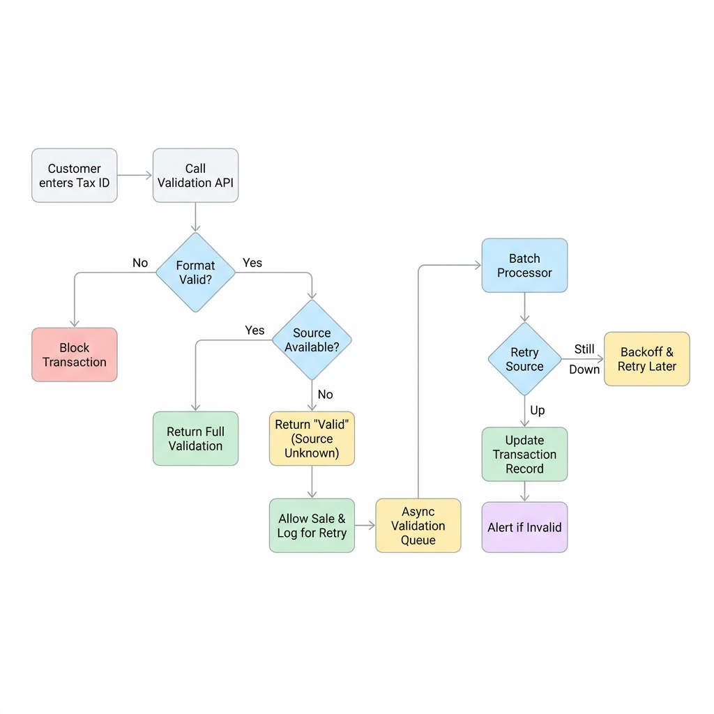

When building tax validation systems, businesses face a critical challenge that often goes unaddressed until it becomes a problem: what happens when official government databases go offline? This isn't a theoretical concern. Tax authority systems experience downtimes, maintenance windows, and temporary outages that can disrupt your business operations at the worst possible moments.

At LookupTax, we've developed a nuanced approach that recognizes different validation scenarios require different strategies. Let's explore how smart API design can help you maintain business continuity while ensuring compliance.

## Understanding the Two Validation Scenarios

Before diving into solutions, it's important to recognize that not all tax validation needs are created equal. Think of it this way: validating a tax ID during checkout is fundamentally different from validating vendor information during onboarding.

Real-time validation APIs are designed for runtime scenarios where speed is essential. Picture an e-commerce checkout flow where a customer is entering their GST number or VAT ID. Every second of delay increases the likelihood of cart abandonment. In this context, you need an immediate response that allows the transaction to proceed smoothly.

On the other hand, batch-based asynchronous validation serves a different purpose entirely. When you're onboarding new vendors into your system, updating records in your ERP, or performing accounting reconciliation, the validation doesn't need to happen in milliseconds. You can afford to wait minutes or even hours for a definitive answer. What matters more here is accuracy and completeness, not instantaneous feedback.

## The Downtime Dilemma in Checkout Flows

Here's where things get interesting. When a customer reaches your checkout page and the government's tax validation database happens to be down, you face an impossible choice with traditional systems. Do you block the transaction and risk losing the sale, or do you let it through and risk accepting invalid tax information?

This is precisely the problem we've solved with our enhanced real-time validation approach. When our system detects that the format of a tax ID is valid according to the official structure and rules, but the source database is experiencing downtime, we make an intelligent decision. Rather than returning an error that would block your customer's purchase, we return an overall status of "valid" while marking the source status as null.

Think of this as a trust-but-verify approach. The format validation itself provides significant assurance. If a tax ID follows the correct pattern, uses valid check digits, and conforms to the official structure, there's a high probability it's legitimate. By allowing the transaction to proceed, you preserve the customer experience and protect your revenue while still flagging the validation for later confirmation.

## Technical Architecture: Real-Time vs. Batch

To visualize how these two approaches work in tandem, consider the following architecture. It demonstrates how "Graceful Degradation" during checkout feeds into the "Async Reconciliation" pipeline.

## Making Batch Validation Work for You

For scenarios that don't require immediate responses, we've introduced batch-based asynchronous validation with built-in retry mechanisms. This approach is particularly well-suited for vendor onboarding workflows, where you're processing multiple new suppliers at once, or for accounting systems where you need to validate hundreds or thousands of tax IDs in bulk.

The beauty of batch processing is resilience. When an official source experiences temporary downtime, our system doesn't simply fail and force you to manually retry. Instead, the built-in retry logic automatically attempts validation again after appropriate intervals. This means you can submit a batch of vendor tax IDs for validation, go about your other work, and receive complete, verified results without having to babysit the process.

This automated retry mechanism is especially valuable during known maintenance windows or peak usage times when government systems are most likely to be slow or unavailable. Your validation jobs complete successfully without requiring intervention from your team.

## Reconciling Real-Time Validations After the Fact

Now, you might be wondering: what about those checkout validations that went through during a downtime? How do you verify those later? This is where our system's design truly shines in its practical application.

Every validation response includes metadata that tells you exactly what happened. When you receive a response with `source_attempted=true` and `status=null`, you know that while the format was valid, the official database couldn't be reached for confirmation. These transactions become candidates for follow-up verification.

Your system can easily identify these cases by filtering for this specific combination of flags. Once you've identified validations that need confirmation, you can batch them together and submit them to our asynchronous validation API. This gives you the best of both worlds: customers complete their purchases without friction, and you still achieve complete validation coverage through a deferred verification process.

## Implementing This in Your Workflow

Let's walk through how this might work in practice for an e-commerce platform. During checkout, a customer enters their VAT number. Your system calls our real-time validation API (see our [API Docs](https://demo.lookuptax.com/api) for details), which checks the format immediately. If the format is correct but the EU VIES database is down, you receive a response indicating valid format with null source status.

Your checkout flow proceeds normally, the customer completes their purchase, and they receive their confirmation. Behind the scenes, your system logs this transaction as requiring follow-up validation. Later that day or week, during a scheduled reconciliation job, your system queries for all transactions with pending source validation, batches them together, and submits them to the async validation API.

The async process handles retries automatically if the source is still experiencing issues. Eventually, you receive definitive validation results for all those transactions. If any turn out to be invalid, you can follow your standard procedures for addressing tax documentation issues with customers after the fact, which is far preferable to losing the sale entirely.

## The Revenue Protection Principle

At the heart of this approach is a simple business principle: when faced with uncertainty during a revenue-generating moment, bias toward completing the transaction while maintaining an audit trail for later verification. Format validation alone catches the vast majority of invalid tax IDs, as most errors are simple typos or formatting mistakes rather than deliberately fraudulent entries.

By allowing transactions to proceed when format is valid but source confirmation is unavailable, you're making a calculated decision that protects revenue while still maintaining compliance through deferred verification. This is particularly important in competitive markets where even a few seconds of checkout friction can mean the difference between a completed sale and an abandoned cart.

## Choosing the Right Validation Strategy

The key to implementing this effectively is recognizing which validation strategy fits which use case. Use real-time validation with graceful degradation for customer-facing workflows where speed and conversion matter. Use batch async validation for back-office processes where thoroughness matters more than immediacy.

For vendor onboarding, there's typically no rush. You can afford to wait for definitive validation before granting system access. For accounting reconciliation, you're often working with historical data anyway, so async batch processing makes perfect sense. But for checkout flows, cart abandonment is your enemy, and intelligent fallback strategies become essential.

## Building Resilience Into Your Tax Compliance

Modern tax compliance isn't just about having access to validation APIs. It's about building systems that gracefully handle the real-world messiness of interconnected services, government databases, and network reliability. By implementing both real-time and batch validation strategies, you create a resilient system that maintains business continuity while ensuring compliance.

The combination of format validation, smart fallback logic, and deferred verification through batch processing means you're never forced to choose between revenue and compliance. You can have both, even when official data sources are temporarily unavailable.

At LookupTax, we've designed our APIs to support this balanced approach because we understand that tax validation isn't just a technical checkbox. We support validation across [multiple jurisdictions](/countries) including EU, UK, India, and Australia. It's a critical business process that needs to work reliably under all conditions, supporting both the speed required for customer-facing operations and the thoroughness required for compliance and record-keeping.

Whether you're processing a single checkout or validating thousands of vendor records, having the right validation strategy for each scenario ensures your business keeps moving forward, even when the systems you depend on hit temporary roadblocks.
